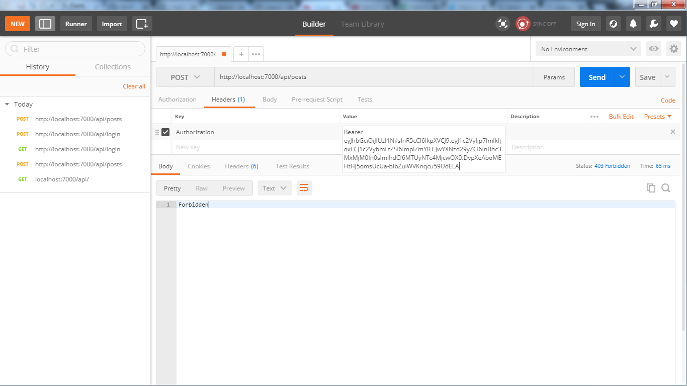

Node js authentication project using JWT token for authentication of a logged in user
To run the project download and run npm install,
make sure you have node js installed in your machine

The project has been tested using Mocha and Chai for unit testing
I have tested the API Requests using Postman client for chrome

*Description of the project, here is a simple get request 

*user authentication,generates the token to be used for authentication

*protecting the public post routes, if not authenticated with a validation for 404 forbiden

*using the generated tokens to log in the user

*Finally user authenticated after using the tokens

*Testing the app using Mocha and Chai
*Finally user authenticated after using the tokens

***Thats it, Happy Coding
